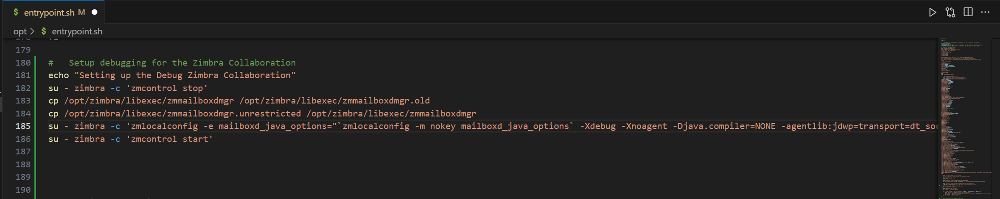
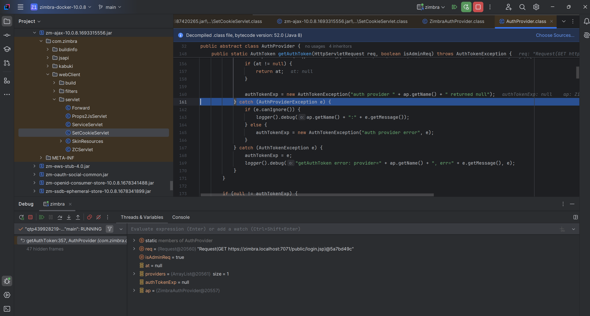

# Zimbra

## Zimbra Setup Debug Blog

### Tìm và dựng Docker có sẵn

- [https://github.com/Zimbra/zm-build](https://github.com/Zimbra/zm-build)

- [https://github.com/lebr0nli/zimbra-docker](https://github.com/lebr0nli/zimbra-docker)

- Search các Repo trên Github, Google và check qua các tutorial Zimbra trên mạng
- Thử build lên Docker tìm được trước build thành công ⇒ Sau đó Custom Docker phù hợp với version Zimbra mà ta mong muốn ⇒ Custom thành công

### Setup Debug

- **Bước quằn nhất khi setup Zimbra ⇒ Mấy bài blog Research được mình sẽ để ở dưới.**
- **Mình có đi research thì thấy các bài setup Debug trên Zimbra như này từ đó mình điều chỉnh file `entrypoint.sh` cho phù hợp:**



```bash
#   Setup debugging for the Zimbra Collaboration
echo "Setting up the Debug Zimbra Collaboration"
su - zimbra -c 'zmcontrol stop'
cp /opt/zimbra/libexec/zmmailboxdmgr /opt/zimbra/libexec/zmmailboxdmgr.old
cp /opt/zimbra/libexec/zmmailboxdmgr.unrestricted /opt/zimbra/libexec/zmmailboxdmgr
su - zimbra -c 'zmlocalconfig -e mailboxd_java_options="`zmlocalconfig -m nokey mailboxd_java_options` -Xdebug -Xnoagent -Djava.compiler=NONE -agentlib:jdwp=transport=dt_socket,server=y,suspend=n,address=*:5005"'
su - zimbra -c 'zmcontrol start'
```

- **Check `/opt/zimbra/conf/localconfig.xml` ⇒ Debug đã được setup**
    
    
    
- **Test Debug bằng JDB:**
    - Test Debug bằng `jdb` trong container:
        
        
        
        Thành công set Debugger
        
    - Test Debug bằng `jbd` ở ngoài máy host:
        - Bị lỗi mọe mất cay vcl ;)))
        
        
        
        - **Check connection từ máy host vào container ⇒ Kết nối từ máy host vào container oke. Không biết lỗi ở đâu ;))) Nhờ vả `supadumb`**
            
            
            
        - **Check lại bằng command của `supadumb` ⇒ Thành công:**
        
        
        
        - **Tự hỏi không biết `supadumb` tìm đâu ra command ⇒ Thử research và đọc docs ⇒ Thấy do mình yếu không chịu đi research**
        
        
        
        - jbd Docs:
            
            [https://www.ibm.com/docs/en/sdk-java-technology/8?topic=applications-debugging-java](https://www.ibm.com/docs/en/sdk-java-technology/8?topic=applications-debugging-java)
            
            [https://docs.oracle.com/en/java/javase/11/tools/jdb.html](https://docs.oracle.com/en/java/javase/11/tools/jdb.html)
            

### Remote Debug Java = Intelliji

- **Do Remote Debug là Intend thiết kế của Zimbra ⇒ Remote debug dùng file Jar để debug từ đó dùng Intelliji ( Intelliji hỗ trợ remote debug java rất tốt )**
- **Copy tất cả file jar trong Zimbra ⇒ Ta biết Zimbra nằm ở folder `/opt/zimbra` ⇒ Command copy toàn bộ file jar:**
    
    ```bash
    find /opt/zimbra/ -type f -name "*.jar" -exec cp {} $ZIMBRA_JAR_DIR 2>/dev/null \; 
    ```
    
- **Từ đó ta thay đổi `entrypoint.sh` cho phù hợp:**
    
    ```bash
    # Copy Zimbra Jar File => If $ZIMBRA_JAR_DIR Folder Not Exist
    if [ ! -d "$ZIMBRA_JAR_DIR" ]; then
        echo "Copy Zimbra Jar to $ZIMBRA_JAR_DIR"
        mkdir -p "$ZIMBRA_JAR_DIR"
        find /opt/zimbra/ -type f -name "*.jar" -exec cp {} $ZIMBRA_JAR_DIR 2>/dev/null \;
    else
        echo "Zimbra Jar Folder Exist"
    fi
    ```
    
- **Ở đây mình đã copy toàn bộ File `.jar` ra một folder có trên trùng với env `$ZIMBRA_JAR_DIR` => Copy Folder chứa toàn bộ file `.jar` :**


- **Thêm JAR vào classpath trong IntelliJ = Vào File > Project Structure (`Ctrl + Alt + Shift + S`).**
- Chọn **Libraries** và **Add** tất cả file `.Jar` vào đây:


- **Cấu hình Debug trong IntelliJ IDEA:**


- **Rồi tìm File Code Đặt Breakpoint từ đó Hit được Debug:**



### Referer

- [https://github.com/Zimbra-Community/zimbra-tools/blob/master/java-debug-zimbra-intellij-ide.md](https://github.com/Zimbra-Community/zimbra-tools/blob/master/java-debug-zimbra-intellij-ide.md)

- [【技术原创】Zimbra漏洞调试环境搭建](https://www.4hou.com/posts/kXWJ)

- [Zimbra漏洞调试环境搭建](https://3gstudent.github.io/Zimbra%E6%BC%8F%E6%B4%9E%E8%B0%83%E8%AF%95%E7%8E%AF%E5%A2%83%E6%90%AD%E5%BB%BA)

- [Zimbra 漏洞分析之路-安全KER - 安全资讯平台](https://www.anquanke.com/post/id/220239)

- **Note: Cảm ơn `Supadumb` đã hỗ trợ mình nhiều trong việc setup Zimbra**